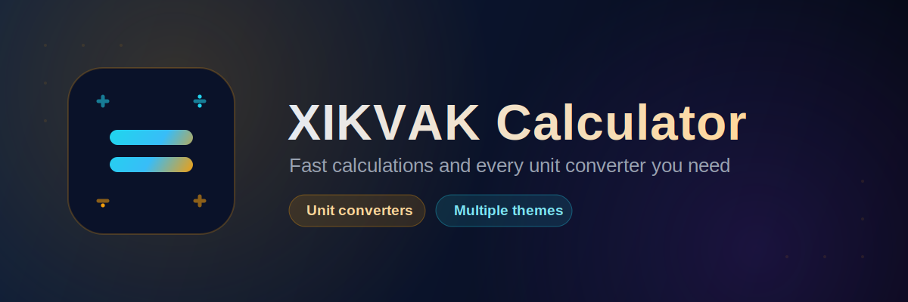
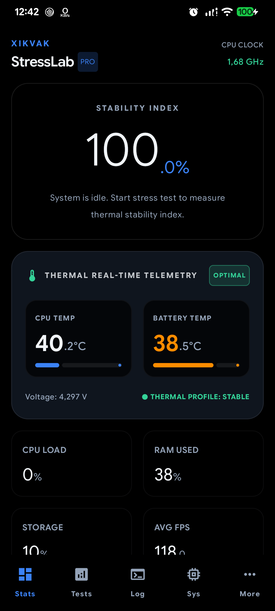
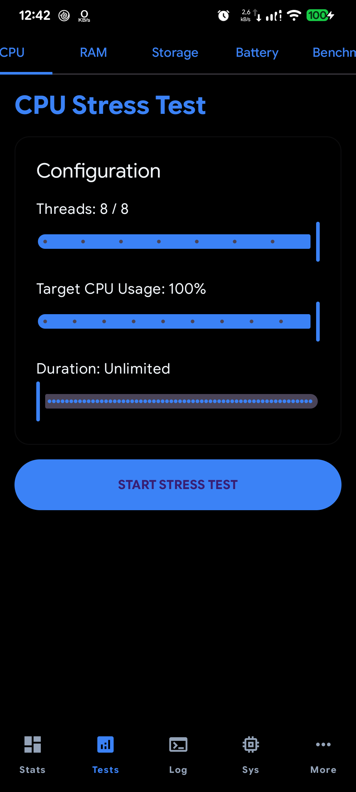

[-blue)](#)

**Push your device to its limits, and watch exactly how it holds up.**

[Download APK](../../releases/latest) · [Features](#-features) · [Screenshots](#-screenshots) · [Install](#-installation) · [Support](#-support-the-project)

---

## 📱 About

**XIKVAK StressLab** is a stress-testing and thermal telemetry app — configure sustained load tests for your CPU, RAM, storage, and battery, then watch real-time temperature, voltage, and stability data while the test runs.

This repository distributes the **compiled APK only** — no source code, no build files.

## ✨ Features

**Stats**
- **Stability Index** — a 0–100% score measuring thermal stability under load
- **Real-time thermal telemetry** — CPU temperature, battery temperature, voltage, and an overall thermal profile status (e.g. Stable / Optimal)
- **Live CPU clock speed**
- Quick-glance tiles for CPU load, RAM used, storage used, and average FPS

**Tests**
- Dedicated stress tests for **CPU, RAM, Storage, Battery**, and a **Benchmark** mode
- Fully configurable CPU stress test — set the number of threads, target CPU usage percentage, and duration (including unlimited)
- One-tap **Start Stress Test**

**Also included**
- **Log** — a record of test activity
- **Sys** — system information
- A **Pro** tier for extended functionality

## 📸 Screenshots

 

## 📥 Installation

1. Go to the **[Releases](../../releases)** page and download the latest `.apk`.
2. On your phone, go to **Settings → Apps → Special access → Install unknown apps**, and allow your browser or file manager to install APKs. (Exact wording varies by Android version/vendor.)
3. Open the downloaded file and tap **Install**.
4. Requires **Android 7.0 (Nougat, API 24) or newer**.

## ⚠️ A note on stress testing

Running your CPU, RAM, storage, or battery at sustained high load is exactly what this app is for — but it will make your device warmer and use more power than normal, by design. Keep an eye on the thermal telemetry while a test runs, and stop early if your device gets uncomfortably hot.

## 💬 Support the project

XIKVAK StressLab is free, with an optional Pro tier. If it's useful to you, a donation of any size keeps development alive:

- **Card (Visa):** `4916 9903 1117 9219`
- **Card holder:** Azizjon
- **Telegram:** [@XlKVAK](https://t.me/XlKVAK)
- **Email:** [xikvak3@gmail.com](mailto:xikvak3@gmail.com)

And if a donation isn't possible — a sincere prayer for the developer is more than enough. Thank you!

Found a bug, or have a feature idea? Reach out through Telegram or email above, or open an [issue](../../issues).

## ⚠️ Disclaimer

XIKVAK StressLab is an independent project and is not affiliated with, endorsed by, or sponsored by any device manufacturer. Stress testing pushes hardware harder than everyday use — use responsibly.

Made with care

